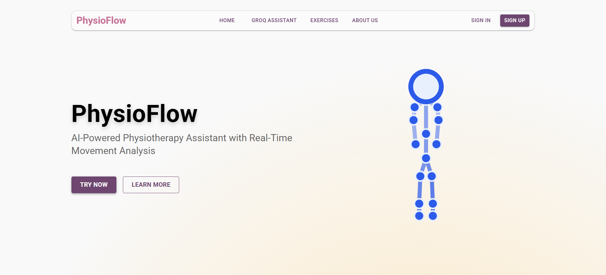

# PhysioFlow

> AI-driven Physiotherapy Assistant (Work in Progress 🚧)



---

## Objective

PhysioFlow AI addresses the accessibility gap in physiotherapy by providing an AI-powered assistant that guides users through exercises with real-time analysis and feedback. It serves:

* Physiotherapy patients who need supervised rehabilitation but have limited access to in-person sessions
* Elderly individuals requiring mobility exercises with proper guidance
* Athletes recovering from injuries who need precise movement tracking
* Healthcare providers looking to extend remote care capabilities
* Anyone seeking to improve physical health with professional-grade guidance

By combining computer vision, multimodal AI, and real-time analysis, PhysioFlow AI makes professional physiotherapy guidance accessible to everyone, everywhere, at any time.

---

## Team & Approach

### Team Name:

The Bois

### Team Members:

* Dhananjay Tiwari ([https://github.com/dhananjay2403](https://github.com/dhananjay2403)) - Frontend + Computer Vision
* Siddharth Kumar ([https://github.com/siddharth23k](https://github.com/siddharth23k)) - Backend + ML
* Lisha Angral ([https://github.com/lishaangral](https://github.com/lishaangral)) - UI Design + Frontend
* Anshul Dhoptey ([https://github.com/Spectre-anshul](https://github.com/Spectre-anshul)) - Computer Vision

### Your Approach:

We recognized a critical gap in healthcare accessibility: while physiotherapy is essential for recovery, many patients struggle with limited access to professionals, high costs, and difficulty maintaining proper form without supervision. We aimed to leverage AI to democratize access to quality rehabilitation.

Key challenges addressed:

* Creating accurate real-time pose detection that works across various body types and lighting conditions
* Developing intelligent form analysis that provides actionable feedback
* Building a responsive design optimized for both mobile and desktop
* Integrating multimodal AI for both visual movement understanding and voice commands
* Providing personalized guidance similar to a human physiotherapist

Pivots and breakthroughs:

* Pivoted from mobile-only to responsive design to accommodate desktop progress tracking
* Simplified approach using MediaPipe + rule-based analysis while maintaining accuracy
* Leveraged Groq’s multimodal AI for richer feedback beyond visual cues

---

## Tech Stack

### Core Technologies Used:

* **Frontend:** React.js, Material UI

* **Backend:** Flask, Python

* **AI/ML:** TensorFlow.js, MediaPipe, OpenCV, Groq API

* **PDF Generation:** jsPDF

* **Authentication:** Firebase Auth

* **Deployment:** The app is designed for deployment on platforms such as Vercel or Netlify for the frontend, and Render or Railway for the backend.

### Sponsor Technologies Used:

**Groq:** Used Groq’s multimodal AI to analyze user movements via camera and provide intelligent, context-aware feedback on exercise form. Groq powers our virtual physiotherapist, enabling natural language feedback and personalized exercise recommendations.

---

## Key Features

✅ Real-time Movement Analysis
✅ Multimodal AI Guidance
✅ Responsive Design
✅ Exercise Library

🚧 **Under Construction (In Progress):**

* Integration of backend with frontend pages
* Connecting Groq AI and computer vision models to implementation page
* Camera-based movement detection pipeline on Implementation Page
* Generating downloadable PDF reports of AI-generated analysis
* Hosting the fully integrated site

Currently, **frontend pages (Home, Exercise, Groq AI Chatbot, Implementation) are built and functional as UI components. Integration of AI and backend logic is pending.**

<!-- ---

## 📽️ Demo & Deliverables

* **Demo Video Link:** \[Link to be added]
* **Pitch Deck / PPT Link:** \[Link to be added] -->

---

### How to Run Locally

1. **Clone the repository**:

   ```bash
   git clone https://github.com/yourusername/physioflow.git
   cd physioflow
   ```

2. **Install frontend dependencies**:

   ```bash
   cd frontend
   npm install
   ```

3. **Install backend dependencies**:

   ```bash
   cd ../backend
   npm install
   ```

4. **Run the frontend**:

   ```bash
   npm start
   ```

5. **Run the backend** (optional, if needed for APIs):

   ```bash
   npm start
   ```

*Configuration files (e.g., `.env`) may be required for API keys.*

> **Note:** Currently, frontend pages are functional and styled; backend routes, AI integration, and camera-based analysis are **not yet connected to frontend components. Integration and hosting are in progress.**

---

## Future Scope

* Yoga Pose Analyzer
* Progress Tracking
* Strength Training Analysis
* Healthcare Provider Dashboard
* Enhanced Voice Interaction
* Native Mobile Apps
* Wearable Integration
* Multilingual Support

---

Research:

* "Computer Vision-Based Systems for Physical Rehabilitation: A Review" (2021)
* "Deep Learning for Human Movement Understanding" (2023)

---

## Acknowledgements

PhysioFlow AI represents our vision for accessible healthcare. The hackathon journey challenged us technically and creatively—from UI design to AI integration.

🔨 While **key UI pages have been created**, we’re actively working on **connecting AI & backend services, integrating camera-based movement detection, and enabling PDF report generation.** Hosting and deployment will follow post-integration.

We thank Groq for powering our AI assistant. This experience has reinforced our belief that AI can transform healthcare for the better.

---